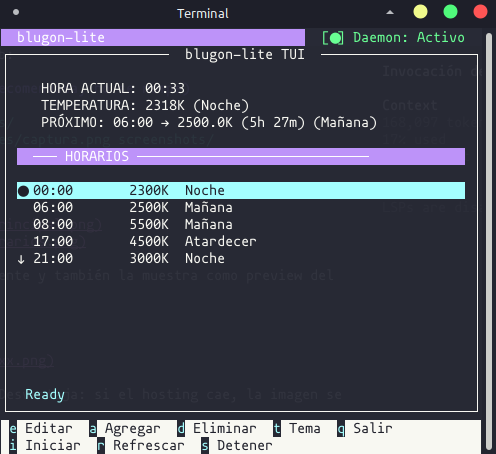
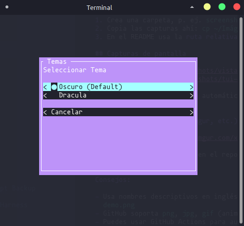
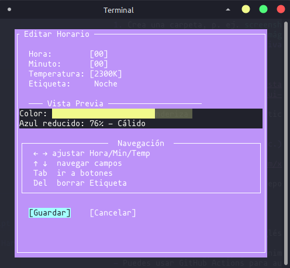

# blugon-lite

**Blue Light Filter for X Window System** - Una versión ligera y moderna de filtro de luz azul para pantallas, hecha para sistemas basados en Debian (Debian/Ubuntu).


---

## 📖 ¿Qué es blugon-lite?

blugon-lite es un filtro de luz azul para X Window System que ajusta automáticamente la temperatura de color de tu pantalla según la hora del día. Reduce la luz azul durante la noche para mejorar la calidad del sueño.

### ✨ Características

- **🌅 Horarios personalizables** - Configura múltiples puntos de temperatura durante el día
- **🎨 TUI intuitivo** - Interfaz de texto tipo htop para configuración fácil
- **💾 Auto-guardado** - Los cambios se persisten automáticamente
- **🎯 Ligero** - Menos de 8MB de RAM, código optimizado
- **📦 Paquete .deb** - Instalación fácil en Debian/Ubuntu
- **🔄 Daemon automático** - Ajusta la pantalla cada 2 minutos

### 🆚 Diferencias con blugon original

| Característica | blugon | blugon-lite |
|---------------|--------|-------------|
| Líneas de código | ~450 | ~240 |
| Consumo RAM | ~15MB | ~8MB |
| TUI incluido | ❌ | ✅ |
| Paquete .deb | ❌ | ✅ |
| Etiquetas personalizadas | ❌ | ✅ |

---

## 📸 Capturas de pantalla

### Interfaz principal



Vista principal del TUI: estado del daemon, temperatura de color actual, próxima transición y lista de horarios configurados.

### Selector de temas



Cambia entre el tema oscuro por defecto y Dracula desde el modal de temas.

### Edición de horarios



Modal para editar hora, minuto, temperatura (Kelvin) y etiqueta, con vista previa del color resultante.

---

## 📦 Instalación

### Desde paquete .deb (Recomendado)

```bash
# Descargar la última versión
wget https://github.com/jozado/blugon-lite/releases/download/v1.0.0/blugon-lite_1.0.0-lite_amd64.deb

# Instalar (las dependencias se resuelven automáticamente)
sudo apt install ./blugon-lite_1.0.0-lite_amd64.deb
```

### Desde código fuente

```bash
# Clonar el repositorio
git clone https://github.com/jozado/blugon-lite.git
cd blugon-lite

# Instalar dependencias
sudo apt install python3-urwid libxrandr-dev libx11-dev

# Compilar backend
cd backends/scg && make build && cd ../..

# Instalar
sudo make install
```

---

## 🚀 Uso

### Abrir el TUI (Recomendado)

```bash
blugon-lite-tui
```

El TUI te permite:
- 👁️ Ver horarios configurados y próxima transición
- ✏️ Editar horarios existentes
- ➕ Agregar nuevos horarios
- 🗑️ Eliminar horarios
- 🎨 Cambiar tema de colores
- 💾 Guardar configuración

### Comandos CLI

```bash
# Aplicar una vez y salir
blugon-lite --once

# Ejecutar como daemon (ajusta cada 120 segundos)
blugon-lite --interval 120

# Usar backend específico
blugon-lite --backend xgamma

# Mostrar versión
blugon-lite --version
```

### Opciones de línea de comandos

| Opción | Descripción |
|--------|-------------|
| `-o, --once` | Aplicar una vez y salir |
| `-i, --interval [segundos]` | Intervalo de actualización (default: 120) |
| `-c, --configdir [ruta]` | Directorio de configuración |
| `-b, --backend [scg\|xgamma]` | Backend a usar |
| `-v, --version` | Mostrar versión |

---

## ⚙️ Configuración

### Archivo de configuración

Los horarios se guardan en `~/.config/blugon/gamma`:

```
# Formato: hora minuto temperatura [etiqueta]
8 0 6500 Mañana
17 0 4500 Atardecer
21 0 3000 Noche
0 0 2000 Madrugada
```

### ¿Cómo funciona la interpolación?

blugon-lite **NO** hace cambios bruscos de temperatura. En cambio, **interpola linealmente** entre los horarios adyacentes para una transición suave.

**Ejemplo con 4 horarios:**

```
Horarios configurados:
  08:00 → 6500K (luz día)
  17:00 → 4500K (atardecer)
  21:00 → 3000K (noche)
  00:00 → 2000K (madrugada)

Línea de tiempo de interpolación:

08:00 ────────────────────── 17:00 ───────────── 21:00 ──────── 00:00
6500K ───────────────────── 4500K ───────────── 3000K ──────── 2000K
       ↑         ↑         ↑         ↑         ↑         ↑
    08:00   12:00     17:00     19:00     21:00     00:00
    6500K   5500K     4500K     3750K     3000K     2000K
```

**Cálculo en diferentes momentos:**

| Hora | Posición en el trayecto | Temperatura resultante |
|------|------------------------|------------------------|
| 08:00 | 0% del camino (inicio) | 6500K exactos |
| 12:00 | 44% entre 08:00 y 17:00 | 5500K |
| 17:00 | 100% del primer trayecto | 4500K exactos |
| 19:00 | 50% entre 17:00 y 21:00 | 3750K |
| 21:00 | 100% del segundo trayecto | 3000K exactos |
| 00:00 | 100% del tercer trayecto | 2000K exactos |

**Fórmula de interpolación:**

```
factor = (hora_actual - hora_anterior) / (hora_siguiente - hora_anterior)
temp_actual = temp_anterior + factor × (temp_siguiente - temp_anterior)
```

**Ejemplo a las 12:00 (entre 08:00 y 17:00):**

```
hora_anterior = 08:00 = 480 minutos
hora_siguiente = 17:00 = 1020 minutos
hora_actual = 12:00 = 720 minutos

factor = (720 - 480) / (1020 - 480) = 240 / 540 = 0.44 (44%)

temp_anterior = 6500K
temp_siguiente = 4500K

temp_actual = 6500 + 0.44 × (4500 - 6500)
            = 6500 + 0.44 × (-2000)
            = 6500 - 880
            = 5620K ≈ 5500K
```

**Importante:** El daemon verifica y recalcula la interpolación **cada 5 minutos** (sincronizado a múltiplos de 5), no continuamente. Esto permite que los cambios programados se apliquen exactamente en la hora indicada.

### Temperaturas recomendadas

| Temperatura | Descripción | Uso |
|-------------|-------------|-----|
| 6500K | Luz día normal | Productividad |
| 4500K | Blanco cálido | Tarde |
| 3000K | Luz cálida | Noche, reduce melatonina |
| 2000K | Luz muy cálida | Pre-sueño |

### Configuraciones predefinidas

El paquete incluye configuraciones para diferentes perfiles:

- **evening** - Horario estándar (17:00-08:00 noche)
- **office** - Trabajador de oficina (9:00-18:00)
- **student** - Estudiante (horarios extendidos)
- **night-owl** - Usuario nocturno
- **minimal** - Solo 3 puntos básicos

---

## 🎨 Temas del TUI

El TUI incluye dos temas:

- **dark** - Tema oscuro por defecto
- **dracula** - Tema inspirado en Dracula

Cambiar tema: Presionar `t` en el TUI.

---

## 🔧 Solución de problemas

### El filtro no aplica cambios

1. Verificar que X11 esté corriendo
2. Probar con backend alternativo:
   ```bash
   blugon-lite --once --backend xgamma
   ```

### Error al iniciar el TUI

1. Verificar que python3-urwid esté instalado:
   ```bash
   sudo apt install python3-urwid
   ```

### Los cambios no persisten

1. Verificar permisos del archivo:
   ```bash
   ls -la ~/.config/blugon/gamma
   ```
2. El archivo debe ser editable por tu usuario

---

## 📁 Estructura del proyecto

```
blugon-lite/
├── blugon-lite.py          # Script principal CLI
├── blugon-lite-tui         # Wrapper para TUI
├── blugon-lite-tui.py      # Punto de entrada TUI
├── backends/
│   └── scg/
│       ├── scg.c           # Backend C + Xrandr
│       └── Makefile
├── tui/
│   ├── app.py              # Aplicación principal TUI
│   ├── modals/             # Modales (edit, add, delete, theme)
│   ├── widgets/            # Widgets personalizados
│   ├── input_handler.py    # Manejo de input
│   └── themes.py           # Temas de colores
├── configs/                # Configuraciones predefinidas
└── debian/                 # Empaquetado .deb
```

---

## 🤝 Contribuir

1. Fork el repositorio
2. Crear rama para feature (`git checkout -b feature/nueva-caracteristica`)
3. Commit cambios (`git commit -m 'feat: agregar nueva característica'`)
4. Push a la rama (`git push origin feature/nueva-caracteristica`)
5. Abrir Pull Request

---

## 📄 Licencia

MIT License - ver archivo [LICENSE](LICENSE) para detalles.

---

## 🙏 Agradecimientos

- Proyecto original [blugon](https://github.com/jumper149/blugon) de jumper149
- Algoritmo de temperatura a gamma por [Tanner Helland](http://www.tannerhelland.com/4435/)

---

## 📬 Contacto

- Issues: [GitHub Issues](https://github.com/jozado/blugon-lite/issues)
- Email: jozado@yahoo.com
